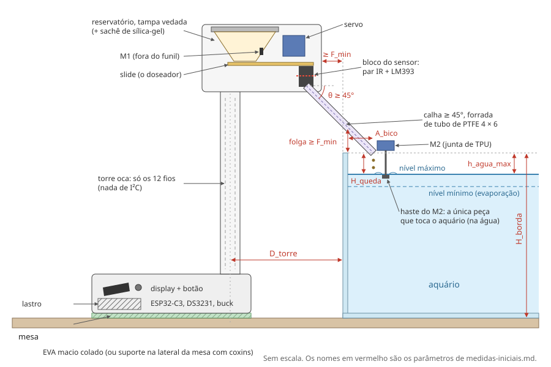

# Modelagem 3D — módulo alimentador do BettaCare

Briefing para quem vai modelar a estrutura impressa do alimentador. O BettaCare
é um controlador de aquário para um peixe betta; o alimentador é um aparelho à
parte que solta ração seca, **um grão de ~1 mm por vez**, e confere cada grão
num feixe infravermelho. A eletrônica e o firmware já existem; falta o corpo.

Leia nesta ordem:

1. este README — o conceito, as regras e o que entregar;
2. [`medidas-iniciais.md`](./medidas-iniciais.md) — parâmetros, peças e
   tolerâncias;
3. [`doseador.md`](./doseador.md) — o mecanismo que separa um grão, a parte
   crítica;
4. [`ficha-de-medicao.md`](./ficha-de-medicao.md) — o que o Arthur mede no
   aquário antes de você fechar as alturas;
5. os croquis: [`croqui-lateral.svg`](./croqui-lateral.svg) e
   [`croqui-doseador.svg`](./croqui-doseador.svg).

A montagem elétrica (para saber o que vai dentro de cada parte) está em
[`../pinagem-alimentador-modulo.md`](../pinagem-alimentador-modulo.md), §8.

---

## O conceito

Três partes, impressas separadas e unidas por parafuso, para que qualquer uma
possa ser reimpressa sozinha:

| Parte | O que leva | Onde fica |
|---|---|---|
| **Base** | A placa com o ESP32-C3, o relógio (DS3231), o display e o botão no painel da frente, a fonte (buck), o conector do cabo que vem do controlador principal e o jack de 12 V | Na mesa, ao lado do aquário, sobre EVA macio colado — ou presa na lateral da mesa por um suporte com coxins de borracha |
| **Torre** | Nada além dos fios: é oca | Sobe da base até acima da borda do aquário |
| **Topo** | O reservatório de ração com o motor de vibração M1, o slide movido pelo servo, o bloco do sensor infravermelho e o começo da calha | No alto da torre, **ao lado** do aquário, não sobre ele |
| **Calha (bico)** | Um tubo inclinado que leva o grão por cima da borda até a água, com o motor M2 na ponta | O único braço que avança sobre o aquário |

O grão sai do reservatório, cai no bolso do slide, é levado pelo slide até a
boca do tubo, cai pelo feixe infravermelho (que o conta) e desce rolando pela
calha até a água. Antes, o M2 faz a ponta da calha tremer de leve na água: é o
"sinal da comida" que o peixe aprende.

---

## Regras que não mudam

1. **Nada encosta no vidro nem na tampa do aquário.** Folga mínima de 10 mm em
   toda a volta. A única coisa do módulo que toca o aquário é a haste do M2, na
   água — de propósito. Vibração no vidro vira zumbido para o peixe o dia
   inteiro.
2. **Nunca um caminho direto do reservatório ao tubo.** Em qualquer posição do
   slide — inclusive no meio do curso, com o servo solto, travado ou quebrado —
   ele fecha a saída do reservatório ou a boca do tubo. Uma falha mecânica não
   pode virar o reservatório inteiro dentro do aquário (`doseador.md`).
3. **Um grão por vez.** O bolso do slide comporta exatamente um grão. O tamanho
   certo sai da bancada, por isso o slide é paramétrico e vem num jogo de
   calibração.
4. **Vibração fica no módulo.** O M1 vibra o funil de propósito, o servo dá
   pequenos trancos e o M2 vibra a ponta da calha. A base se isola da mesa por
   EVA macio ou coxins; nenhuma peça rígida liga o módulo ao móvel do aquário.
5. **Umidade é o inimigo.** A água evapora ao lado: ração úmida empelota, e o
   sensor infravermelho embaça. Reservatório com tampa vedada; a calha termina
   pelo menos 25 mm acima da água; a eletrônica da base ventila por baixo e
   pelas laterais, nunca por cima.
6. **Manutenção sem ferramenta especial.** O reservatório reabastece por cima
   sem desmontar nada. O slide, o bloco do sensor e a calha saem para limpeza
   (ração gruda). O chicote de fios da torre tem conector nas duas pontas.
7. **Não tomba.** Apoiado só no EVA, com o reservatório cheio e alguém
   apertando o botão, o módulo fica de pé: a base leva lastro.
8. **Ração só toca PETG liso.** Sem frestas onde a ração se acumule e mofe.

---

## O que entregar

- **Modelo paramétrico**, com o arquivo-fonte do CAD (FreeCAD, Fusion 360 ou
  Onshape) e os parâmetros com os nomes de `medidas-iniciais.md`. As alturas
  dependem do aquário (`ficha-de-medicao.md`), e o bolso do slide será
  ajustado na bancada — reabrir o modelo tem de ser barato.
- **STEP** de cada peça e da montagem.
- **STL** de cada peça, já na orientação de impressão.
- **Jogo de calibração do slide:** slides com bolso de 1,2 / 1,3 / 1,4 / 1,5 /
  1,6 mm, cada um com o número gravado.
- **Bloco do sensor** como peça própria, trocável: é o que mais deve iterar.
- **Folha de montagem:** ordem, parafusos, insertos, onde vai cada placa.
- **Perfil de impressão sugerido** por peça (camada, paredes, preenchimento,
  suporte).

## Como as peças serão aceitas

O firmware já tem os testes de bancada (`teste grao`, `teste feixe`, `calibrar`
— ver o [README do firmware](../../firmware/feeder-module/README.md)).

| Teste | Passa quando |
|---|---|
| Slide no canal, empurrado com um dedo | Corre sem prender e sem folga lateral perceptível |
| `calibrar` | Em repouso, o bolso fica inteiro sob a saída do reservatório; em despejo, inteiro sobre a boca do tubo — com pelo menos 10° de diferença entre os dois ângulos |
| Slide parado no meio do curso, à mão, reservatório cheio | Nenhum grão chega ao tubo |
| `teste grao`, dez vezes, com a ração real | Dez em dez: um grão por dose, visto pelo sensor |
| `teste feixe`, passando grãos pela boca do tubo | Cada grão conta uma vez |
| Calha, com a ração real | Nenhum grão para no meio do caminho |
| Montado no aquário | Nenhum ponto a menos de 10 mm do vidro ou da tampa; a haste do M2 toca a água com o nível máximo e com o mínimo |
| Empurrar o topo de lado com um dedo, reservatório cheio | Não tomba, não desliza |
| Reservatório cheio, esvaziado pela dosagem | Nada de ração presa nos cantos |
