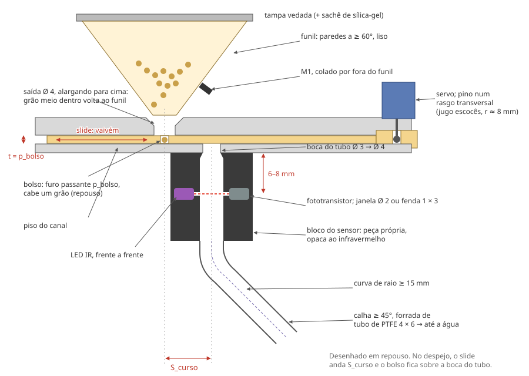

# O doseador

A parte que separa **um grão** do reservatório e o entrega ao feixe
infravermelho. É a parte crítica: o resto do módulo é caixa. Corte esquemático
em [`croqui-doseador.svg`](./croqui-doseador.svg).



---

## Como funciona

Um slide — uma régua fina com um furo, o **bolso** — corre num canal sob o
reservatório. Ele vai e volta entre duas posições, empurrado pelo servo:

- **Repouso:** o bolso fica sob a saída do reservatório. Um grão cai nele; o
  motor de vibração M1, colado no funil, ajuda a ração a descer.
- **Despejo:** o slide anda `S_curso` e leva o bolso até a boca do tubo, no
  piso do canal. O grão cai pelo tubo e corta o feixe infravermelho, que o
  conta.

Uma refeição de 5 grãos são 5 idas e voltas, uns 1 s cada. Se uma ida não traz
grão, o M1 vibra e o slide tenta de novo; três seguidas sem grão e o firmware
para (reservatório vazio ou slide travado). O firmware calibra os dois ângulos
do servo na bancada — o modelo não precisa acertar ângulo nenhum, só a
geometria.

```text
              tampa vedada (com sachê de sílica-gel)
         ┌──────────────────────────┐
         │          ração           │
          \                        /    funil: paredes a ≥ 60° da horizontal
           \                      /     M1 colado por fora, perto da saída
            \       ┌────┐       /
             \______│ Ø4 │______/       saída do reservatório (alarga para cima)
 ═══════════════════╡    ╞════════════════════════════  teto do canal
   ┌────────────────[bolso]─────────────────────────┐   slide (espessura t = p)
 ══╧══════════════════════════════════╡ Ø3 ╞════════╧═  piso do canal
                                      │    │            boca do tubo
                     LED IR ▶═══ janela ·  janela ═══◀ fototransistor
                                      │    │  feixe a 6–8 mm do piso
                                      │ Ø4 │
                                       \    \           curva de raio ≥ 15 mm
                                        \    \          calha a ≥ 45°, forrada
                                         \    \         de tubo de PTFE 4 × 6
         |←──────── S_curso ─────────→|
       eixo da saída               eixo do tubo
```

---

## Regra 1: nunca um caminho direto

O bolso é o **único** furo do slide. Haveria um caminho direto do reservatório
ao tubo só se o bolso cobrisse a saída e a boca ao mesmo tempo. Para isso
nunca acontecer, em nenhuma posição:

```text
S_curso  >  raio da saída + raio da boca + p_bolso  +  margem de 3 mm
         >  2 + 1,5 + 1,4 + 3  ≈  8 mm
```

E o slide precisa ser comprido o bastante para continuar cobrindo a saída e a
boca **em todo o curso que o servo consegue produzir** — não só entre os dois
ângulos calibrados. Com a ligação do servo abaixo, o slide vai no máximo `r`
para cada lado do centro: material sólido de pelo menos `S_curso` + `r` + 3 mm
para cada lado do bolso.

Faça o teste na mão: reservatório cheio, slide parado em qualquer ponto do
curso — nenhum grão chega ao tubo.

## O bolso e o slide

- **Bolso:** furo passante de diâmetro `p_bolso` numa régua de espessura `t =
  p_bolso`. Um grão de 1 mm cabe inteiro; dois não cabem lado a lado nem um
  sobre o outro. Com grão de 1 mm, `p_bolso` entre 1,3 e 1,5 mm — o certo sai
  da bancada, com a ração real.
- **Jogo de calibração:** cinco slides, `p_bolso` = 1,2 / 1,3 / 1,4 / 1,5 /
  1,6 mm (e `t` igual), com o número gravado na parte de fora do canal.
- O slide é fino só onde corre no canal. Fora dele, na ponta que o servo
  empurra, pode engrossar para 3 mm.
- **Canal:** folga total de 0,2 mm na espessura e 0,3 mm na largura. Menos
  que isso prende; mais que isso deixa um grão entrar na fresta.
- **Saída do reservatório:** Ø 4 mm onde encosta no slide, alargando para
  cima (um funil curto). Um grão que fica meio dentro do bolso na hora em que
  o slide sai é empurrado de volta para cima, em vez de ser cortado ou travar
  o slide.
- **Boca do tubo:** Ø 3 mm no piso do canal, alargando para Ø 4 mm logo
  abaixo — o grão nunca encosta numa borda viva ao cair.

## A ligação do servo

Um pino no braço do servo corre num rasgo transversal na ponta do slide (o
"jugo escocês"): o giro vira vaivém sem biela.

- Raio do pino `r` ≈ 8 mm. Com o curso entre os ângulos de fábrica do firmware
  (40° e 100°), o slide anda ≈ 7,5 mm. A calibração acerta o resto.
- Rasgo com largura = Ø do pino + 0,2 mm, e comprimento ≥ 2 × `r` + Ø do pino
  + 2 mm: o pino passeia pelo rasgo inteiro numa volta de 180°.
- Pino: um parafuso M2 com espaçador no furo do braço original do servo
  (o braço impresso não acerta o estriado do eixo).
- **Sem batente.** O canal deixa o slide andar `r` para cada lado do centro
  sem bater em nada. Assim nenhum ângulo do servo — nem um comando errado na
  calibração — o faz forçar contra o plástico.

## O reservatório

- Volume útil de ~10 ml. A ração gasta ~10 grãos por dia e perde qualidade em
  um ou dois meses depois de aberta: o reservatório recebe pouco de cada vez.
  O tamanho importa mais pelo funil do que pela capacidade.
- **Funil com paredes a 60° ou mais da horizontal**, liso, sem degrau: é o que
  evita a ração formar ponte sobre a saída.
- Tampa com vedação (anel de TPU ou de silicone) e um nicho para um sachê de
  sílica-gel. Reabastece por cima, sem desmontar nada.
- **M1** colado numa área plana de 12 × 12 mm na parede de fora do funil,
  perto da saída. Ele nunca toca a ração.
- Em PETG natural, a parede deixa ver o nível.

## O bloco do sensor

Peça própria e trocável: é a que mais vai mudar na bancada.

- Furo vertical de Ø 4 mm, continuação da boca do tubo.
- LED infravermelho e fototransistor **frente a frente**, em furos cegos de
  Ø 5,1 mm abertos por fora, cada um encostado pela aba. O eixo deles cruza o
  eixo do furo **6 a 8 mm abaixo do piso do canal**, onde o grão ainda cai
  perto do centro.
- Entre cada um e o furo, uma **janela estreita**: redonda de Ø 2 mm, ou uma
  fenda horizontal de 1 × 3 mm. É ela que deixa o feixe fino o bastante para
  um grão de 1 mm cortar uma boa parte dele. Faça as duas variantes no
  primeiro lote.
- O material precisa ser **opaco ao infravermelho** (ver `medidas-iniciais.md`,
  §5), e não pode haver linha reta da luz da sala ou da luminária até o
  fototransistor: abaixo do feixe, pelo menos 15 mm de furo antes da curva
  da calha.
- O trimpot do módulo LM393 (que fica no topo, perto do bloco) precisa de
  acesso por fora: ele é ajustado uma vez, com o grão de teste.

## A calha

- Do pé do bloco do sensor sai uma **curva de raio ≥ 15 mm** para a inclinação
  da calha (`theta_calha`, ≥ 45°) — o grão desce sem quicar de volta.
- O trecho inclinado é **forrado com tubo de PTFE de 4 × 6 mm** (DI × DE, o
  das impressoras 3D): liso, não gruda e troca barato. A calha impressa é só o
  braço que o segura.
- Na saída, uma **pingadeira**: a borda corta a gota que condensa, para que ela
  não volte por dentro do tubo.
- **M2 na ponta**, num suporte preso à calha por uma junta de TPU — a vibração
  fica na ponta, e não sobe para o sensor. Do suporte desce a **haste**: um
  bastão de PETG de Ø 3 mm com uma pazinha de 5 × 8 mm na ponta, mergulhando
  3–5 mm na água, com ajuste de altura (rasgo e parafuso) para o nível que
  varia (`medidas-iniciais.md`, §2). O motor fica acima da água e protegido de
  respingos; só a haste molha.
- A calha sai do topo, então pesa sobre ele: braço leve, oco onde der.

## Limpeza

Ração gruda. Sem ferramenta especial:

- o reservatório sai de cima do canal;
- o piso do canal sai por dois parafusos, e o slide sai com ele;
- o bloco do sensor sai por baixo;
- o tubo de PTFE puxa para fora da calha.
